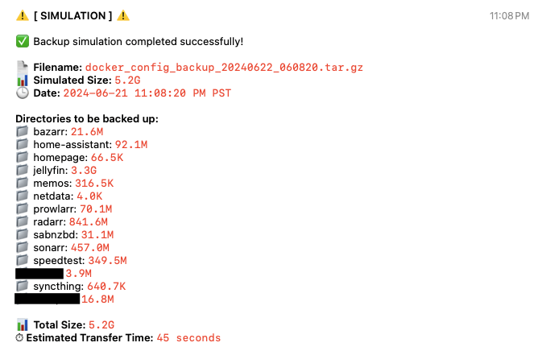

# Docker Config Backup Script (w/ Telegram Notifs!)

This Bash script automates the process of backing up Docker configuration files and as an emphasis on sending beautiful, simple notifications via Telegram. It's designed to be customizable and easy to use, with options for simulating backups before running them for real.



## Features

- Backs up specified configuration directories and a docker-compose file
- Calculates total backup size and estimated transfer time
- Sends detailed notifications via Telegram
- Supports simulation mode for testing
- Handles large messages by splitting them when necessary

## Prerequisites

Before you begin, ensure you have met the following requirements:

- You have a Linux-based system with Bash
- You have installed the following dependencies:
  - `curl`
  - `jq`
  - `bc`
- You have created a Telegram bot and obtained its API token
- You have the Chat ID of the Telegram chat where you want to receive notifications

## Installation

1. Clone this repository or download the script file.
2. Make the script executable:

   ```
   chmod +x docker_config_backup.sh
   ```

3. Open the script in a text editor and configure the variables at the top of the file:

   ```bash
   BACKUP_DIR=""                  # Directory where backups will be stored
   CONFIG_DIR=""                  # Directory containing configuration files to be backed up
   DOCKER_COMPOSE_FILE=""         # Path to the docker-compose.yml file
   TELEGRAM_TOKEN=""              # Telegram Bot API token
   TELEGRAM_CHAT_ID=""            # Telegram Chat ID to send messages to
   MAX_SIZE_GB=6                  # Maximum allowed backup size in GB
   UPLOAD_SPEED_MBPS=125          # Upload speed in Mbps (default is 1 Gbps = 125 MB/s)
   TIMEZONE="America/Los_Angeles" # Timezone for date display (e.g., "America/New_York", "Europe/London")
   ```

## Usage

To run the backup script:

```
./docker_config_backup.sh
```

To run the script in simulation mode (no actual backup will be created):

```
./docker_config_backup.sh --sim
```

## Customization

You can customize the script by modifying the variables at the top of the file:

- `BACKUP_DIR`: Set this to the directory where you want to store your backups.
- `CONFIG_DIR`: Set this to the directory containing the Docker configuration files you want to back up.
- `DOCKER_COMPOSE_FILE`: Set this to the path of your docker-compose.yml file.
- `TELEGRAM_TOKEN`: Your Telegram Bot API token.
- `TELEGRAM_CHAT_ID`: The Chat ID where you want to receive Telegram notifications.
- `MAX_SIZE_GB`: The maximum allowed size for the backup in GB.
- `UPLOAD_SPEED_MBPS`: Your upload speed in Mbps, used to calculate estimated transfer times.
- `TIMEZONE`: Set this to your desired timezone (e.g., "America/New_York", "Europe/London", "Asia/Tokyo").
  You can find a list of valid timezone names [here](https://en.wikipedia.org/wiki/List_of_tz_database_time_zones).

## Troubleshooting

If you encounter issues, try the following:

1. **Telegram messages not sending**: 
   - Verify your `TELEGRAM_TOKEN` and `TELEGRAM_CHAT_ID` are correct.
   - Ensure your bot has permission to send messages to the specified chat.

2. **Backup size calculation issues**:
   - Make sure you have read permissions for all directories specified in `CONFIG_DIR`.

3. **Script fails to create backup**:
   - Check that you have write permissions in the `BACKUP_DIR`.
   - Ensure you have read permissions for the `CONFIG_DIR` and `DOCKER_COMPOSE_FILE`.

4. **Incorrect transfer time estimates**:
   - Adjust the `UPLOAD_SPEED_MBPS` variable to match your actual upload speed.

5. **Script fails to run**:
   - Ensure you've made the script executable with `chmod +x docker_config_backup.sh`.
   - Check that you have `curl`, `jq`, and `bc` installed on your system.

## Contributing

Contributions to improve the script are welcome. Please feel free to submit a Pull Request.
